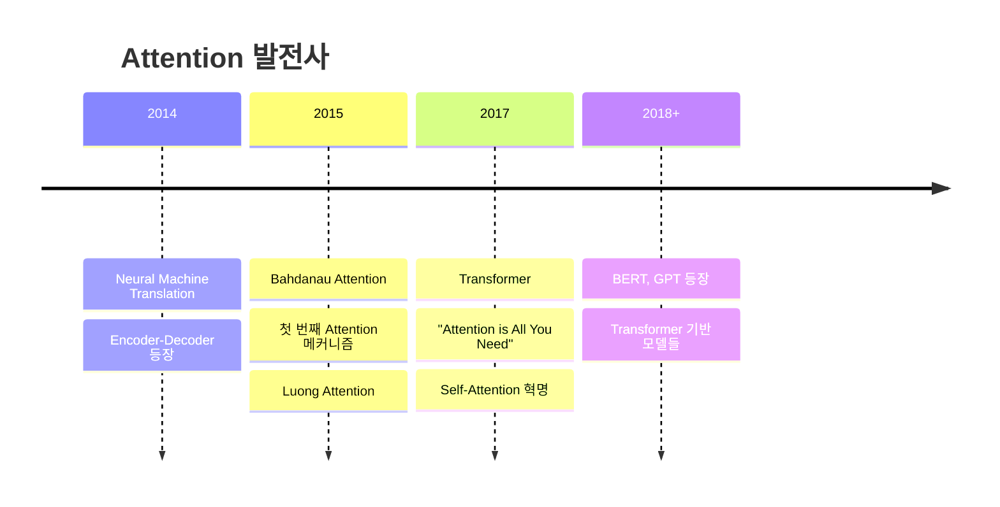

# 🚀 **Transformer 파이썬으로 완전정복!**

> **"Attention is All You Need"** - 2017년 구글의 혁명적인 논문 🎯  
> 이제 우리도 Transformer를 처음부터 끝까지 파이썬으로 구현해보자! 💪

---

## 🎯 **목차**

1. [🔍 Transformer 개요](#transformer-개요)
2. [🧠 Self-Attention의 기본 원리](#self-attention의-기본-원리)
3. [🎪 Single-Head Attention 구현](#single-head-attention-구현)
4. [🎭 Multi-Head Attention 구현](#multi-head-attention-구현)
5. [🏗️ Transformer 블록 구현](#transformer-블록-구현)
6. [🎨 Multi-Head Cross Attention](#multi-head-cross-attention)
7. [🚀 실전 활용 예시](#실전-활용-예시)
8. [⚡ 성능 최적화 팁](#성능-최적화-팁)

---

## 🔍 **Transformer 개요**

### **🤔 Transformer가 뭔가요?**

Transformer는 2017년 구글에서 발표한 **"Attention is All You Need"** 논문에서 처음 소개된 neural network 아키텍처입니다!

### **📚 Attention의 역사** 

**Attention 개념 자체는 Transformer 등장 전부터 이미 있었어요!** 🕰️

#### **2015년 이전: 초기 Attention** 🔍
```python
# 예시: Seq2Seq with Attention (2015년)
class OldAttention(nn.Module):
    """기존의 RNN + Attention 방식"""
    def __init__(self):
        super().__init__()
        self.encoder_rnn = nn.LSTM(input_size, hidden_size)
        self.decoder_rnn = nn.LSTM(input_size, hidden_size) 
        self.attention = nn.Linear(hidden_size * 2, 1)  # 간단한 attention
    
    def forward(self, encoder_outputs, decoder_hidden):
        # 모든 encoder state와 현재 decoder state 비교
        attention_scores = []
        for encoder_output in encoder_outputs:
            # Concatenate and score
            combined = torch.cat([encoder_output, decoder_hidden], dim=1)
            score = self.attention(combined)
            attention_scores.append(score)
        
        # Softmax로 가중치 계산
        attention_weights = F.softmax(torch.stack(attention_scores), dim=0)
        
        # Weighted sum of encoder outputs
        context = torch.sum(attention_weights.unsqueeze(-1) * encoder_outputs, dim=0)
        return context, attention_weights
```

**초기 Attention의 특징**:
- 🔄 **RNN과 함께 사용**: LSTM/GRU encoder-decoder와 결합
- 📍 **단방향**: Decoder가 encoder를 "보는" 용도 (Cross Attention)
- 🎯 **번역 문제 해결**: 긴 문장에서 정보 손실 방지
- **🎪 Single-Head만 존재**: Multi-Head 개념은 아직 없었음!
- 👥 **대표적 연구**: Bahdanau (2015), Luong (2015)

#### **💡 Single-Head Cross Attention (SHCA) 시대** 
```python
# 2015년 스타일: Single-Head Cross Attention
class SingleHeadCrossAttention_2015(nn.Module):
    """Transformer 이전의 SHCA 방식"""
    def __init__(self, encoder_dim, decoder_dim):
        super().__init__()
        # 단 하나의 attention head만 존재!
        self.attention_layer = nn.Linear(encoder_dim + decoder_dim, 1)
        
    def forward(self, encoder_outputs, decoder_hidden):
        batch_size, seq_len, encoder_dim = encoder_outputs.size()
        
        # 모든 encoder output과 현재 decoder state 결합
        attention_scores = []
        for i in range(seq_len):
            # Concatenate encoder output with decoder hidden
            combined = torch.cat([
                encoder_outputs[:, i, :],  # i-th encoder output
                decoder_hidden.squeeze(0)   # current decoder state
            ], dim=1)
            
            # Single attention score 계산
            score = self.attention_layer(combined)  # 오직 하나의 점수!
            attention_scores.append(score)
        
        # Softmax normalization
        attention_weights = F.softmax(torch.stack(attention_scores, dim=1), dim=1)
        
        # Weighted sum (context vector)
        context = torch.sum(
            attention_weights.unsqueeze(-1) * encoder_outputs, 
            dim=1
        )
        
        return context, attention_weights

# 실제 2015년 논문에서 사용된 방식
def bahdanau_attention_2015(encoder_outputs, decoder_hidden):
    """Bahdanau et al. (2015) 방식"""
    # 파라미터들
    W_a = nn.Linear(hidden_size, hidden_size)  # encoder projection
    U_a = nn.Linear(hidden_size, hidden_size)  # decoder projection  
    v_a = nn.Linear(hidden_size, 1)           # final scoring layer
    
    # Attention computation
    seq_len = encoder_outputs.size(1)
    scores = []
    
    for i in range(seq_len):
        # Additive attention (not dot-product!)
        score = v_a(torch.tanh(
            W_a(encoder_outputs[:, i, :]) +  # encoder contribution
            U_a(decoder_hidden)              # decoder contribution
        ))
        scores.append(score)
    
    # Single attention distribution
    attention_weights = F.softmax(torch.cat(scores, dim=1), dim=1)
    
    # Context vector
    context = torch.sum(
        attention_weights.unsqueeze(-1) * encoder_outputs, 
        dim=1
    )
    
    return context, attention_weights
```

**🎯 SHCA의 한계들**:
- **단일 관점**: 오직 하나의 attention pattern만 학습
- **제한된 표현력**: 복잡한 관계 포착 어려움  
- **정보 병목**: 모든 정보가 하나의 context vector로 압축
- **다양성 부족**: 문법적, 의미적 관계를 동시에 학습하기 어려움

#### **2017년: Transformer의 혁신** ⚡

**🎭 Multi-Head Attention (MHCA) 등장!**

```python
# Transformer의 Multi-Head Self-Attention (2017년)
class MultiHeadSelfAttention_2017(nn.Module):
    """혁신적인 Multi-Head Self-Attention"""
    def __init__(self, d_model, n_heads=8):
        super().__init__()
        self.n_heads = n_heads
        self.d_k = d_model // n_heads  # 각 head의 차원
        
        # 여러 개의 attention head를 위한 projection!
        self.W_q = nn.Linear(d_model, d_model)  # 8개 head 동시에
        self.W_k = nn.Linear(d_model, d_model)  # 8개 head 동시에  
        self.W_v = nn.Linear(d_model, d_model)  # 8개 head 동시에
        self.W_o = nn.Linear(d_model, d_model)  # output projection
        
    def forward(self, x):
        batch_size, seq_len, d_model = x.size()
        
        # Q, K, V를 multiple heads로 분할
        Q = self.W_q(x).view(batch_size, seq_len, self.n_heads, self.d_k).transpose(1, 2)
        K = self.W_k(x).view(batch_size, seq_len, self.n_heads, self.d_k).transpose(1, 2)  
        V = self.W_v(x).view(batch_size, seq_len, self.n_heads, self.d_k).transpose(1, 2)
        
        # 각 head에서 독립적으로 attention 계산!
        attention_scores = torch.matmul(Q, K.transpose(-2, -1)) / math.sqrt(self.d_k)
        attention_weights = F.softmax(attention_scores, dim=-1)
        
        # Multi-head attention 적용
        context = torch.matmul(attention_weights, V)
        
        # Concatenate heads
        context = context.transpose(1, 2).contiguous().view(
            batch_size, seq_len, d_model
        )
        
        # Final output projection
        output = self.W_o(context)
        
        return output, attention_weights

# 비교: Single-Head vs Multi-Head
def compare_attention_mechanisms():
    """SHCA vs MHCA 비교"""
    
    # Single-Head (2015년 방식)
    single_head_output = single_attention_head(x)  # 1개 관점
    
    # Multi-Head (2017년 방식) 
    multi_head_output = []
    for head in range(8):  # 8개 다른 관점!
        head_output = attention_head(x, head_id=head)
        multi_head_output.append(head_output)
    
    # 8개 head의 결과를 결합
    combined_output = concatenate_and_project(multi_head_output)
    
    return combined_output
```

### **🚀 SHCA → MHCA 혁명적 변화**

| **SHCA (2015년)** | **MHCA (2017년)** |
|-------------------|-------------------|
| 🎯 **1개 관점** | 🎭 **8개 관점** |
| 📍 **Cross Attention만** | 🔄 **Self + Cross** |
| 🔄 **RNN 의존** | 🚫 **RNN 제거** |
| 🐌 **순차 처리** | ⚡ **병렬 처리** |
| 📊 **단순 가중합** | 🧠 **복합 표현** |

#### **🎪 Multi-Head의 마법적 효과**

각 head가 **서로 다른 종류의 관계**를 학습합니다:

```python
# 예시: "The cat sat on the mat" 분석
sentence = "The cat sat on the mat"

# Head 1: 문법적 관계 학습
head_1_attention = [
    # "cat" → "The" (관사-명사 관계)
    # "sat" → "cat" (주어-동사 관계)  
    # "on" → "sat" (동사-전치사 관계)
]

# Head 2: 의미적 관계 학습  
head_2_attention = [
    # "cat" → "mat" (고양이가 매트와 관련)
    # "sat" → "on" (앉는 동작과 위치)
]

# Head 3: 위치적 관계 학습
head_3_attention = [
    # 인접한 단어들 간의 관계
    # "The" → "cat", "cat" → "sat" 등
]

# Head 4-8: 다른 추상적 관계들...
```

**🔥 Multi-Head의 혁신적 장점**:
- **🎯 다양한 관점**: 문법, 의미, 위치 등 동시 학습
- **🧠 풍부한 표현**: 복잡한 언어 패턴 포착  
- **⚡ 병렬 계산**: 모든 head가 동시에 처리
- **🚀 성능 향상**: 실제로 번역/이해 성능 대폭 개선

**💡 결과**: Single-Head의 한계를 완전히 극복! 🎉

### **🔥 Transformer의 3대 혁신**

| 기존 Attention (2015) | Transformer Attention (2017) |
|---------------------|----------------------------|
| 🔄 **RNN 필수** | 🚫 **RNN 없음** |
| 📍 **Encoder→Decoder만** | 🔄 **Self-Attention** |
| 🎯 **단일 Head** | 🎭 **Multi-Head** |
| 🐌 **순차 처리** | ⚡ **병렬 처리** |


**혁신 포인트**:
1. **🧠 Self-Attention**: 같은 시퀀스 내에서 모든 위치가 서로 관계 학습
2. **🎭 Multi-Head**: 여러 관점에서 동시에 attention 계산  
3. **⚡ 병렬화**: RNN 없이도 시퀀스 처리 가능

### **📈 발전 과정 요약**



**💡 결론**: Attention은 기존에 있던 개념이지만, **Transformer가 완전히 새로운 레벨로 끌어올렸습니다!** 🚀

**핵심 아이디어**: 
- 🚫 **RNN/LSTM 없이도** 시퀀스 데이터 처리 가능
- ⚡ **병렬처리** 가능으로 학습 속도 대폭 향상
- 🎯 **Self-Attention** 메커니즘으로 장거리 의존성 해결

### **🌟 왜 혁명적인가?**

| 기존 방법 (RNN/LSTM) | Transformer |
|---------------------|-------------|
| 🐌 순차적 처리 (느림) | ⚡ 병렬 처리 (빠름) |
| 😵 장거리 의존성 문제 | 🎯 직접적 연결 |
| 🔄 Gradient Vanishing | ✅ 안정적 학습 |

---

## 🧠 **Self-Attention의 기본 원리**

### **💡 핵심 개념**

Self-Attention은 **"각 단어가 다른 단어들과 얼마나 관련있는지"**를 계산하는 메커니즘입니다!

```python
# 예시: "The cat sat on the mat"
# "cat"이라는 단어가 다른 단어들과 얼마나 관련있을까?
# cat -> The (0.1), cat (1.0), sat (0.8), on (0.2), the (0.1), mat (0.3)
```

### **🔑 Query, Key, Value 개념**

Think of it like a **search engine**! 🔍

- **Query (Q)**: "내가 찾는 것" - 현재 단어의 관심사
- **Key (K)**: "검색 키워드" - 다른 단어들의 특성
- **Value (V)**: "실제 내용" - 단어의 실제 정보

```python
import torch
import torch.nn as nn
import torch.nn.functional as F
import math

def simple_attention_example():
    """간단한 Attention 예시"""
    
    # 예시 문장: "I love AI"
    # 각 단어를 3차원 벡터로 표현
    sentence = torch.tensor([
        [1.0, 0.0, 0.0],  # "I"
        [0.0, 1.0, 0.0],  # "love"  
        [0.0, 0.0, 1.0]   # "AI"
    ])
    
    # Query, Key, Value 계산 (단순화)
    Q = sentence  # Query: 각 단어가 무엇을 찾고 있나?
    K = sentence  # Key: 각 단어의 특성
    V = sentence  # Value: 각 단어의 실제 정보
    
    # Attention Score 계산
    attention_scores = torch.matmul(Q, K.transpose(-2, -1))
    print("Attention Scores:")
    print(attention_scores)
    
    # Softmax로 확률 변환
    attention_weights = F.softmax(attention_scores, dim=-1)
    print("\nAttention Weights:")
    print(attention_weights)
    
    # 최종 출력
    output = torch.matmul(attention_weights, V)
    print("\nFinal Output:")
    print(output)

# 실행
simple_attention_example()
```

---

## 🎪 **Single-Head Attention 구현**

이제 진짜 Self-Attention을 구현해보자! 🎉

```python
class SingleHeadAttention(nn.Module):
    def __init__(self, d_model, d_k=None):
        super().__init__()
        self.d_model = d_model
        self.d_k = d_k or d_model
        
        # Linear layers for Q, K, V
        self.W_q = nn.Linear(d_model, self.d_k, bias=False)
        self.W_k = nn.Linear(d_model, self.d_k, bias=False)
        self.W_v = nn.Linear(d_model, self.d_k, bias=False)
        
        # Output projection
        self.W_o = nn.Linear(self.d_k, d_model, bias=False)
        
        # Scaling factor
        self.scale = math.sqrt(self.d_k)
        
    def forward(self, x, mask=None):
        """
        Args:
            x: Input tensor (batch_size, seq_len, d_model)
            mask: Optional mask tensor
        Returns:
            output: Attention output (batch_size, seq_len, d_model)
            attention_weights: Attention weights (batch_size, seq_len, seq_len)
        """
        batch_size, seq_len, _ = x.size()
        
        # 1. Linear projections
        Q = self.W_q(x)  # (batch_size, seq_len, d_k)
        K = self.W_k(x)  # (batch_size, seq_len, d_k)
        V = self.W_v(x)  # (batch_size, seq_len, d_k)
        
        # 2. Scaled dot-product attention
        attention_scores = torch.matmul(Q, K.transpose(-2, -1)) / self.scale
        
        # 3. Apply mask if provided
        if mask is not None:
            attention_scores = attention_scores.masked_fill(mask == 0, -1e9)
        
        # 4. Apply softmax
        attention_weights = F.softmax(attention_scores, dim=-1)
        
        # 5. Apply attention to values
        context = torch.matmul(attention_weights, V)
        
        # 6. Output projection
        output = self.W_o(context)
        
        return output, attention_weights

# 테스트해보기! 🧪
def test_single_head_attention():
    """Single-Head Attention 테스트"""
    
    # 모델 생성
    d_model = 512
    attention = SingleHeadAttention(d_model)
    
    # 더미 데이터 생성 (배치 크기 2, 시퀀스 길이 10)
    batch_size, seq_len = 2, 10
    x = torch.randn(batch_size, seq_len, d_model)
    
    # Forward pass
    output, weights = attention(x)
    
    print(f"Input shape: {x.shape}")
    print(f"Output shape: {output.shape}")
    print(f"Attention weights shape: {weights.shape}")
    
    # Attention 패턴 시각화
    import matplotlib.pyplot as plt
    
    plt.figure(figsize=(10, 8))
    plt.imshow(weights[0].detach().numpy(), cmap='Blues', aspect='auto')
    plt.colorbar()
    plt.title("Single-Head Attention Pattern")
    plt.xlabel("Key Position")
    plt.ylabel("Query Position")
    plt.show()

# 실행
test_single_head_attention()
```

### **🔍 코드 해석**

1. **Query, Key, Value 생성**: 입력을 3개의 서로 다른 관점으로 변환
2. **Attention Score 계산**: Q와 K의 내적으로 유사도 측정
3. **Scaling**: √d_k로 나누어 gradient 안정화
4. **Softmax**: 확률 분포로 변환
5. **Context 계산**: Attention 가중치를 Value에 적용

---

## 🎭 **Multi-Head Attention 구현**

이제 **여러 개의 attention head**를 사용해봅시다! 🎪

### **🤔 왜 Multi-Head인가?**

- 🎯 **다양한 관점**: 각 head가 다른 종류의 관계를 학습
- 🧠 **풍부한 표현**: 더 복잡한 패턴 포착 가능
- 🚀 **성능 향상**: 실제로 더 좋은 결과!

```python
class MultiHeadAttention(nn.Module):
    def __init__(self, d_model, n_heads, dropout=0.1):
        super().__init__()
        assert d_model % n_heads == 0
        
        self.d_model = d_model
        self.n_heads = n_heads
        self.d_k = d_model // n_heads
        
        # Linear layers for Q, K, V
        self.W_q = nn.Linear(d_model, d_model, bias=False)
        self.W_k = nn.Linear(d_model, d_model, bias=False)
        self.W_v = nn.Linear(d_model, d_model, bias=False)
        
        # Output projection
        self.W_o = nn.Linear(d_model, d_model, bias=False)
        
        # Dropout
        self.dropout = nn.Dropout(dropout)
        
        # Scaling factor
        self.scale = math.sqrt(self.d_k)
        
    def forward(self, query, key, value, mask=None):
        """
        Args:
            query: Query tensor (batch_size, seq_len, d_model)
            key: Key tensor (batch_size, seq_len, d_model)
            value: Value tensor (batch_size, seq_len, d_model)
            mask: Optional mask tensor
        Returns:
            output: Multi-head attention output
            attention_weights: Average attention weights across heads
        """
        batch_size, seq_len = query.size(0), query.size(1)
        
        # 1. Linear projections and reshape for multi-head
        Q = self.W_q(query).view(batch_size, seq_len, self.n_heads, self.d_k).transpose(1, 2)
        K = self.W_k(key).view(batch_size, seq_len, self.n_heads, self.d_k).transpose(1, 2)
        V = self.W_v(value).view(batch_size, seq_len, self.n_heads, self.d_k).transpose(1, 2)
        
        # 2. Apply attention for each head
        attention_output, attention_weights = self.scaled_dot_product_attention(
            Q, K, V, mask, self.scale
        )
        
        # 3. Concatenate heads
        attention_output = attention_output.transpose(1, 2).contiguous().view(
            batch_size, seq_len, self.d_model
        )
        
        # 4. Final linear projection
        output = self.W_o(attention_output)
        
        return output, attention_weights
    
    def scaled_dot_product_attention(self, Q, K, V, mask, scale):
        """Scaled Dot-Product Attention"""
        # Attention scores
        attention_scores = torch.matmul(Q, K.transpose(-2, -1)) / scale
        
        # Apply mask if provided
        if mask is not None:
            attention_scores = attention_scores.masked_fill(mask == 0, -1e9)
        
        # Softmax
        attention_weights = F.softmax(attention_scores, dim=-1)
        attention_weights = self.dropout(attention_weights)
        
        # Apply attention to values
        context = torch.matmul(attention_weights, V)
        
        return context, attention_weights

# 실전 예시! 🎯
def demonstrate_multi_head_attention():
    """Multi-Head Attention 실제 사용 예시"""
    
    # 모델 설정
    d_model = 512
    n_heads = 8
    mha = MultiHeadAttention(d_model, n_heads)
    
    # 예시 문장 생성 (실제로는 embedding layer에서 나옴)
    batch_size, seq_len = 2, 20
    x = torch.randn(batch_size, seq_len, d_model)
    
    # Self-Attention (query, key, value 모두 동일)
    output, weights = mha(x, x, x)
    
    print(f"🎯 Multi-Head Attention Results:")
    print(f"Input shape: {x.shape}")
    print(f"Output shape: {output.shape}")
    print(f"Attention weights shape: {weights.shape}")
    
    # 각 head의 attention pattern 시각화
    visualize_attention_heads(weights[0], n_heads)

def visualize_attention_heads(attention_weights, n_heads):
    """Attention head들의 패턴 시각화"""
    import matplotlib.pyplot as plt
    
    fig, axes = plt.subplots(2, 4, figsize=(20, 10))
    axes = axes.flatten()
    
    for i in range(n_heads):
        im = axes[i].imshow(attention_weights[i].detach().numpy(), 
                           cmap='Blues', aspect='auto')
        axes[i].set_title(f'Head {i+1}')
        axes[i].set_xlabel('Key Position')
        axes[i].set_ylabel('Query Position')
        plt.colorbar(im, ax=axes[i])
    
    plt.tight_layout()
    plt.suptitle('Multi-Head Attention Patterns', fontsize=16, y=1.02)
    plt.show()

# 실행
demonstrate_multi_head_attention()
```

### **🎪 Multi-Head의 마법**

각 head는 다른 종류의 관계를 학습합니다:

- **Head 1**: 문법적 관계 (주어-동사)
- **Head 2**: 의미적 관계 (동의어, 반의어)
- **Head 3**: 위치적 관계 (인접한 단어들)
- **Head 4**: 장거리 의존성 (문장 처음-끝)

🎯 **결과**: 더 풍부하고 정확한 표현!

---

## 🏗️ **Transformer 블록 구현**

이제 완전한 Transformer 블록을 만들어봅시다! 🎉

```python
class TransformerBlock(nn.Module):
    def __init__(self, d_model, n_heads, d_ff, dropout=0.1):
        super().__init__()
        
        # Multi-Head Attention
        self.attention = MultiHeadAttention(d_model, n_heads, dropout)
        
        # Feed-Forward Network
        self.feed_forward = nn.Sequential(
            nn.Linear(d_model, d_ff),
            nn.ReLU(),
            nn.Dropout(dropout),
            nn.Linear(d_ff, d_model)
        )
        
        # Layer Normalization
        self.ln1 = nn.LayerNorm(d_model)
        self.ln2 = nn.LayerNorm(d_model)
        
        # Dropout
        self.dropout = nn.Dropout(dropout)
        
    def forward(self, x, mask=None):
        """
        Args:
            x: Input tensor (batch_size, seq_len, d_model)
            mask: Optional attention mask
        Returns:
            output: Transformer block output
        """
        # 1. Multi-Head Attention + Residual Connection + Layer Norm
        attn_output, attn_weights = self.attention(x, x, x, mask)
        x = self.ln1(x + self.dropout(attn_output))
        
        # 2. Feed-Forward + Residual Connection + Layer Norm
        ff_output = self.feed_forward(x)
        x = self.ln2(x + self.dropout(ff_output))
        
        return x, attn_weights

# 완전한 Transformer 모델! 🚀
class SimpleTransformer(nn.Module):
    def __init__(self, vocab_size, d_model=512, n_heads=8, n_layers=6, 
                 d_ff=2048, max_seq_len=5000, dropout=0.1):
        super().__init__()
        
        self.d_model = d_model
        
        # Embedding layers
        self.token_embedding = nn.Embedding(vocab_size, d_model)
        self.position_embedding = nn.Embedding(max_seq_len, d_model)
        
        # Transformer blocks
        self.transformer_blocks = nn.ModuleList([
            TransformerBlock(d_model, n_heads, d_ff, dropout)
            for _ in range(n_layers)
        ])
        
        # Final layer norm
        self.ln_final = nn.LayerNorm(d_model)
        
        # Dropout
        self.dropout = nn.Dropout(dropout)
        
    def forward(self, x, mask=None):
        """
        Args:
            x: Input token ids (batch_size, seq_len)
            mask: Optional attention mask
        Returns:
            output: Transformer output (batch_size, seq_len, d_model)
            attention_weights: List of attention weights from each layer
        """
        batch_size, seq_len = x.size()
        
        # Token embeddings
        token_emb = self.token_embedding(x)
        
        # Position embeddings
        positions = torch.arange(seq_len, device=x.device).unsqueeze(0).expand(batch_size, -1)
        pos_emb = self.position_embedding(positions)
        
        # Combine embeddings
        x = self.dropout(token_emb + pos_emb)
        
        # Apply transformer blocks
        attention_weights = []
        for block in self.transformer_blocks:
            x, attn_weights = block(x, mask)
            attention_weights.append(attn_weights)
        
        # Final layer norm
        x = self.ln_final(x)
        
        return x, attention_weights

# 실제 사용 예시! 🎯
def test_transformer():
    """Transformer 모델 테스트"""
    
    # 모델 생성
    vocab_size = 10000
    model = SimpleTransformer(vocab_size)
    
    # 더미 데이터 생성
    batch_size, seq_len = 2, 50
    input_ids = torch.randint(0, vocab_size, (batch_size, seq_len))
    
    # Forward pass
    output, attention_weights = model(input_ids)
    
    print(f"🚀 Transformer Results:")
    print(f"Input shape: {input_ids.shape}")
    print(f"Output shape: {output.shape}")
    print(f"Number of layers: {len(attention_weights)}")
    
    # 모델 파라미터 수 계산
    total_params = sum(p.numel() for p in model.parameters())
    print(f"Total parameters: {total_params:,}")
    
    return model, output, attention_weights

# 실행
model, output, attention_weights = test_transformer()
```

---

## 🎨 **Multi-Head Cross Attention**

드디어 **Cross Attention**! 🎉 이건 **다른 시퀀스 간의 관계**를 학습합니다!

### **🤔 언제 사용하나요?**

- 🌍 **번역**: 영어 문장 → 한국어 문장
- 🖼️ **이미지 캡셔닝**: 이미지 → 텍스트
- 🎵 **음성 인식**: 오디오 → 텍스트

```python
class MultiHeadCrossAttention(nn.Module):
    def __init__(self, d_model, n_heads, dropout=0.1):
        super().__init__()
        self.multihead_attention = MultiHeadAttention(d_model, n_heads, dropout)
        
    def forward(self, query, key, value, mask=None):
        """
        Cross Attention: Query는 target, Key/Value는 source
        
        Args:
            query: Target sequence (batch_size, tgt_len, d_model)
            key: Source sequence (batch_size, src_len, d_model)  
            value: Source sequence (batch_size, src_len, d_model)
            mask: Optional cross-attention mask
        Returns:
            output: Cross attention output
            attention_weights: Cross attention weights
        """
        return self.multihead_attention(query, key, value, mask)

# Encoder-Decoder with Cross Attention! 🎪
class EncoderDecoderTransformer(nn.Module):
    def __init__(self, src_vocab_size, tgt_vocab_size, d_model=512, 
                 n_heads=8, n_layers=6, d_ff=2048, max_seq_len=5000, dropout=0.1):
        super().__init__()
        
        self.d_model = d_model
        
        # Encoder
        self.encoder = SimpleTransformer(src_vocab_size, d_model, n_heads, 
                                       n_layers, d_ff, max_seq_len, dropout)
        
        # Decoder with Cross Attention
        self.decoder_embedding = nn.Embedding(tgt_vocab_size, d_model)
        self.decoder_pos_embedding = nn.Embedding(max_seq_len, d_model)
        
        self.decoder_blocks = nn.ModuleList([
            DecoderBlock(d_model, n_heads, d_ff, dropout)
            for _ in range(n_layers)
        ])
        
        self.ln_final = nn.LayerNorm(d_model)
        self.output_projection = nn.Linear(d_model, tgt_vocab_size)
        self.dropout = nn.Dropout(dropout)
        
    def forward(self, src, tgt, src_mask=None, tgt_mask=None):
        """
        Args:
            src: Source sequence (batch_size, src_len)
            tgt: Target sequence (batch_size, tgt_len)
            src_mask: Source attention mask
            tgt_mask: Target attention mask (causal mask)
        Returns:
            output: Decoder output (batch_size, tgt_len, tgt_vocab_size)
        """
        # Encode source
        encoder_output, _ = self.encoder(src, src_mask)
        
        # Decode target
        batch_size, tgt_len = tgt.size()
        
        # Target embeddings
        tgt_emb = self.decoder_embedding(tgt)
        positions = torch.arange(tgt_len, device=tgt.device).unsqueeze(0).expand(batch_size, -1)
        pos_emb = self.decoder_pos_embedding(positions)
        
        tgt_emb = self.dropout(tgt_emb + pos_emb)
        
        # Apply decoder blocks
        for block in self.decoder_blocks:
            tgt_emb = block(tgt_emb, encoder_output, tgt_mask, src_mask)
        
        # Final projection
        output = self.output_projection(self.ln_final(tgt_emb))
        
        return output

class DecoderBlock(nn.Module):
    def __init__(self, d_model, n_heads, d_ff, dropout=0.1):
        super().__init__()
        
        # Self-Attention
        self.self_attention = MultiHeadAttention(d_model, n_heads, dropout)
        
        # Cross-Attention
        self.cross_attention = MultiHeadCrossAttention(d_model, n_heads, dropout)
        
        # Feed-Forward
        self.feed_forward = nn.Sequential(
            nn.Linear(d_model, d_ff),
            nn.ReLU(),
            nn.Dropout(dropout),
            nn.Linear(d_ff, d_model)
        )
        
        # Layer Normalizations
        self.ln1 = nn.LayerNorm(d_model)
        self.ln2 = nn.LayerNorm(d_model)
        self.ln3 = nn.LayerNorm(d_model)
        
        self.dropout = nn.Dropout(dropout)
        
    def forward(self, tgt, encoder_output, tgt_mask=None, src_mask=None):
        """
        Args:
            tgt: Target sequence embeddings
            encoder_output: Encoder output (source representation)
            tgt_mask: Target self-attention mask (causal)
            src_mask: Source attention mask
        """
        # 1. Self-Attention on target
        self_attn_output, _ = self.self_attention(tgt, tgt, tgt, tgt_mask)
        tgt = self.ln1(tgt + self.dropout(self_attn_output))
        
        # 2. Cross-Attention (target attends to source)
        cross_attn_output, _ = self.cross_attention(tgt, encoder_output, encoder_output, src_mask)
        tgt = self.ln2(tgt + self.dropout(cross_attn_output))
        
        # 3. Feed-Forward
        ff_output = self.feed_forward(tgt)
        tgt = self.ln3(tgt + self.dropout(ff_output))
        
        return tgt

# 실제 번역 예시! 🌍
def translation_example():
    """번역 모델 예시"""
    
    # 모델 생성
    src_vocab_size = 10000  # 영어 어휘
    tgt_vocab_size = 8000   # 한국어 어휘
    
    model = EncoderDecoderTransformer(src_vocab_size, tgt_vocab_size)
    
    # 예시 데이터
    batch_size = 2
    src_len, tgt_len = 20, 25
    
    src = torch.randint(0, src_vocab_size, (batch_size, src_len))  # 영어 문장
    tgt = torch.randint(0, tgt_vocab_size, (batch_size, tgt_len))  # 한국어 문장
    
    # Causal mask 생성 (decoder가 미래 토큰을 보지 못하도록)
    tgt_mask = torch.tril(torch.ones(tgt_len, tgt_len)).unsqueeze(0).unsqueeze(0)
    
    # Forward pass
    output = model(src, tgt, tgt_mask=tgt_mask)
    
    print(f"🌍 Translation Model Results:")
    print(f"Source shape: {src.shape}")
    print(f"Target shape: {tgt.shape}")
    print(f"Output shape: {output.shape}")
    
    # 번역 확률 계산
    translation_probs = F.softmax(output, dim=-1)
    predicted_tokens = torch.argmax(translation_probs, dim=-1)
    
    print(f"Predicted tokens shape: {predicted_tokens.shape}")
    
    return model, output

# 실행
model, output = translation_example()
```

---

## 🚀 **실전 활용 예시**

### **1️⃣ 감정 분석 모델** 😊😢

```python
class SentimentAnalyzer(nn.Module):
    def __init__(self, vocab_size, d_model=256, n_heads=8, n_layers=4):
        super().__init__()
        
        self.transformer = SimpleTransformer(vocab_size, d_model, n_heads, n_layers)
        self.classifier = nn.Sequential(
            nn.Linear(d_model, 128),
            nn.ReLU(),
            nn.Dropout(0.1),
            nn.Linear(128, 3)  # Positive, Negative, Neutral
        )
        
    def forward(self, x):
        # Transformer encoding
        transformer_output, _ = self.transformer(x)
        
        # Global average pooling
        sentence_embedding = transformer_output.mean(dim=1)
        
        # Classification
        sentiment_scores = self.classifier(sentence_embedding)
        
        return sentiment_scores

# 사용 예시
sentiment_model = SentimentAnalyzer(vocab_size=10000)
text_ids = torch.randint(0, 10000, (32, 50))  # 배치 크기 32, 시퀀스 길이 50
sentiment_scores = sentiment_model(text_ids)
print(f"Sentiment scores shape: {sentiment_scores.shape}")  # [32, 3]
```

### **2️⃣ 이미지 캡셔닝 모델** 🖼️→📝

```python
class ImageCaptioning(nn.Module):
    def __init__(self, vocab_size, d_model=512, n_heads=8, n_layers=6):
        super().__init__()
        
        # 이미지 인코더 (예: CNN features)
        self.image_encoder = nn.Linear(2048, d_model)  # CNN features → d_model
        
        # 텍스트 디코더
        self.text_decoder = SimpleTransformer(vocab_size, d_model, n_heads, n_layers)
        
        # Cross-attention for image-text alignment
        self.cross_attention = MultiHeadCrossAttention(d_model, n_heads)
        
        # Output projection
        self.output_projection = nn.Linear(d_model, vocab_size)
        
    def forward(self, image_features, text_ids):
        """
        Args:
            image_features: CNN features (batch_size, num_regions, 2048)
            text_ids: Text token ids (batch_size, seq_len)
        """
        # Encode image features
        image_emb = self.image_encoder(image_features)
        
        # Decode text
        text_emb, _ = self.text_decoder(text_ids)
        
        # Cross-attention: text attends to image
        cross_attn_output, _ = self.cross_attention(text_emb, image_emb, image_emb)
        
        # Combine and project
        combined = text_emb + cross_attn_output
        output = self.output_projection(combined)
        
        return output

# 사용 예시
captioning_model = ImageCaptioning(vocab_size=10000)
image_features = torch.randn(16, 36, 2048)  # 16 images, 36 regions each
text_ids = torch.randint(0, 10000, (16, 20))  # 16 captions, 20 tokens each
captions = captioning_model(image_features, text_ids)
print(f"Generated captions shape: {captions.shape}")  # [16, 20, 10000]
```

---

## ⚡ **성능 최적화 팁**

### **1️⃣ Flash Attention** ⚡

```python
try:
    # Flash Attention 사용 (PyTorch 2.0+)
    from torch.nn.functional import scaled_dot_product_attention
    
    def optimized_attention(Q, K, V, mask=None):
        # Flash Attention 사용으로 메모리 효율성 대폭 향상!
        return scaled_dot_product_attention(Q, K, V, attn_mask=mask)
        
except ImportError:
    # Fallback to standard attention
    def optimized_attention(Q, K, V, mask=None):
        # 기존 방식
        scores = torch.matmul(Q, K.transpose(-2, -1)) / math.sqrt(Q.size(-1))
        if mask is not None:
            scores = scores.masked_fill(mask == 0, -1e9)
        weights = F.softmax(scores, dim=-1)
        return torch.matmul(weights, V)
```

### **2️⃣ Gradient Checkpointing** 💾

```python
import torch.utils.checkpoint as checkpoint

class OptimizedTransformerBlock(nn.Module):
    def __init__(self, d_model, n_heads, d_ff, dropout=0.1):
        super().__init__()
        # ... 기존 코드 ...
        
    def forward(self, x, mask=None):
        # Gradient checkpointing으로 메모리 사용량 줄이기
        return checkpoint.checkpoint(self._forward, x, mask)
    
    def _forward(self, x, mask=None):
        # 실제 forward 로직
        attn_output, _ = self.attention(x, x, x, mask)
        x = self.ln1(x + self.dropout(attn_output))
        
        ff_output = self.feed_forward(x)
        x = self.ln2(x + self.dropout(ff_output))
        
        return x
```

### **3️⃣ Mixed Precision Training** 🎯

```python
from torch.cuda.amp import autocast, GradScaler

# 학습 루프 최적화
scaler = GradScaler()

for batch in dataloader:
    optimizer.zero_grad()
    
    with autocast():  # Mixed precision
        output = model(batch)
        loss = criterion(output, targets)
    
    scaler.scale(loss).backward()
    scaler.step(optimizer)
    scaler.update()
```

---

## 🎯 **요약 및 마무리**

### **🌟 우리가 배운 것들**

1. **🧠 Self-Attention**: 각 토큰이 다른 토큰들과의 관계를 학습
2. **🎪 Multi-Head Attention**: 여러 관점에서 동시에 attention 계산
3. **🏗️ Transformer Block**: Attention + Feed-Forward + Residual + LayerNorm
4. **🎨 Cross Attention**: 서로 다른 시퀀스 간의 관계 학습
5. **⚡ 최적화 기법**: Flash Attention, Gradient Checkpointing, Mixed Precision

### **🚀 다음 단계**

- **GPT**: Decoder-only 아키텍처 구현
- **BERT**: Encoder-only 아키텍처 구현  
- **T5**: Encoder-Decoder 아키텍처 구현
- **Vision Transformer**: 이미지에 Transformer 적용

### **💡 핵심 포인트**

> **"Attention is All You Need"** - 정말로 Attention만으로도 충분했습니다! 🎯
> 
> RNN/LSTM 없이도 시퀀스 모델링이 가능하며, 병렬처리로 훨씬 빠르고 효율적입니다.

**🎉 축하합니다!** 이제 여러분은 Transformer를 완전히 이해하고 구현할 수 있습니다! 💪

---

## 📚 **참고 자료**

- [Attention Is All You Need (원논문)](https://arxiv.org/abs/1706.03762)
- [The Illustrated Transformer](https://jalammar.github.io/illustrated-transformer/)
- [PyTorch Official Tutorial](https://pytorch.org/tutorials/beginner/transformer_tutorial.html)
- [Hugging Face Transformers](https://huggingface.co/docs/transformers/index)

---

*이 포스트가 도움이 되었다면 ⭐ 스타와 댓글 부탁드립니다! 🙏* 