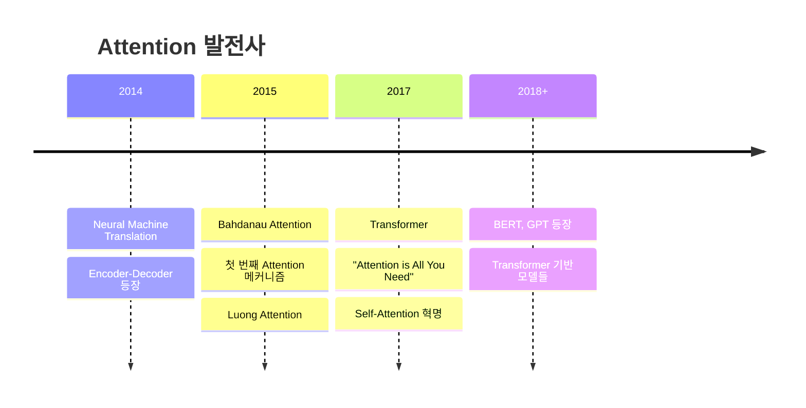

# 🚀 **Transformer 파이썬으로 완전정복!**

> **"Attention is All You Need"** - 2017년 구글의 혁명적인 논문 🎯  
> 이제 우리도 Transformer를 처음부터 끝까지 파이썬으로 구현해보자! 💪

---

## 🎯 **목차**

1. [🔍 Transformer 개요](#overview)
2. [🧠 Self-Attention의 기본 원리](#self-attention-basics)
3. [🎪 Single-Head Attention 구현](#single-head-attention)
4. [🎭 Multi-Head Attention 구현](#multi-head-attention)
5. [🏗️ Transformer 블록 구현](#transformer-block)
6. [🎨 Multi-Head Cross Attention](#multi-head-cross-attention)
7. [🚀 실전 활용 예시](#practical-examples)
8. [⚡ 성능 최적화 팁](#optimization-tips)
9. [🎯 요약 및 마무리](#summary)
10. [📚 참고 자료](#references)

---

## 🔍 **Transformer 개요** {#overview}

### **🤔 Transformer가 뭔가요?**

Transformer는 2017년 구글에서 발표한 **"Attention is All You Need"** 논문에서 처음 소개된 neural network 아키텍처입니다!

### **📚 Attention의 역사** 

**Attention 개념 자체는 Transformer 등장 전부터 이미 있었어요!** 🕰️
> 다만 우리가 알고있는 Q / K / V 가 없었다!!  
> Q/K/V는 Transformer 이후 명확히 정리된 표현이야!!  

#### ** 초기 Attention(SHCA: Single-head Cross Attention)** 🔍

- LSTM의 인코딩 : 기존의 LSTM은 문장을 순서대로 읽고 `hidden_state`를 생성한다(뒤에서 보려고)!!  
- LSTM의 디코딩 : `hidden_state`를 바탕으로 결과 단어를 출력한다!  
- 여기서!! 문장이 길어질수록 앞의 내용을 까먹는 문제가 말생!!  
- 그래서 Attention을 제시했다!! → LSTM에서 출력을 생성할떄 hidden_state가 아니라 과거 문장의 전체를 보고 어디를 집중할지 본다!!  


**그래서!! AI 가 정리한 초기 Attention의 특징**:
- 🔄 **RNN과 함께 사용**: LSTM/GRU encoder-decoder와 결합
- 📍 **단방향**: Decoder가 encoder를 "보는" 용도 (Cross Attention)
- 🎯 **번역 문제 해결**: 긴 문장에서 정보 손실 방지
- **🎪 Single-Head만 존재**: Multi-Head 개념은 아직 없었음!
- 👥 **대표적 연구**: Bahdanau (2015), Luong (2015)

```python
import torch
import torch.nn as nn
import torch.nn.functional as F

class OldAttention(nn.Module):
    """🔁 2015년 Seq2Seq + Attention 구조 예시 (Bahdanau-style)"""
    def __init__(self):
        super().__init__()
        # 🔹 인코더: 입력 시퀀스를 처리하는 LSTM (hidden_size는 출력 차원)
        self.encoder_rnn = nn.LSTM(input_size, hidden_size)

        # 🔹 디코더: 출력을 순차적으로 생성하는 LSTM
        self.decoder_rnn = nn.LSTM(input_size, hidden_size)

        # 🔸 어텐션 스코어 계산용 선형 레이어
        # 인코더와 디코더 hidden state를 연결해 점수화 (concat → score)
        self.attention = nn.Linear(hidden_size * 2, 1)

    def forward(self, encoder_outputs, decoder_hidden):
        """
        Args:
            encoder_outputs: (seq_len, hidden_size) - 인코더의 전체 출력 시퀀스
            decoder_hidden: (1, hidden_size) - 현재 디코더의 hidden state
        Returns:
            context: (1, hidden_size) - 인코더 출력들의 weighted sum
            attention_weights: (seq_len,) - softmax attention weights
        """

        attention_scores = []

        # 🔁 각 인코더 출력 벡터와 현재 디코더 상태를 비교하여 score 계산
        for encoder_output in encoder_outputs:
            # 🧩 인코더 출력과 디코더 상태를 연결 (concat)
            # decoder_hidden 가 Q역할, encoder_output가 K V 역할을한다!! 
            ## 왜냐하면 decoder_hidden는 무엇을 보고싶은가! Query 하는거고,
            ## encoder_output가 인코더 위치의 특성(K), 실제 정보를 담고 있는 벡터(V) 역할을 한다!
            combined = torch.cat([encoder_output, decoder_hidden], dim=1)

            # 📏 선형 레이어를 통과시켜 scalar score 출력
            score = self.attention(combined)  # (1, 1)
            attention_scores.append(score)

        # 🔃 attention_scores: [(1,1), (1,1), ...] → (seq_len, 1)
        attention_scores = torch.stack(attention_scores, dim=0)

        # 📊 softmax로 확률화하여 attention weight 계산
        attention_weights = F.softmax(attention_scores, dim=0)  # (seq_len, 1)

        # 🧮 각 인코더 출력에 attention weight 곱해서 합산 (가중합)
        # encoder_outputs: (seq_len, hidden_size)
        # attention_weights: (seq_len, 1) → broadcasting
        context = torch.sum(attention_weights * encoder_outputs, dim=0)  # (1, hidden_size)

        return context, attention_weights  # context는 디코더에 전달되는 "요약 정보"

```


#### **2017년: Transformer의 혁신** ⚡

**🎭 Multi-Head Attention (MHCA) 등장!**

> 우리가 아닌 'Attention is all you Need!'  
> RNN 없에 Attention 만으로, 
> 여기서 Q,K,V  개념 정리 및  Q=K=V  self attention 개념과    
> 다각도에서 보는 Multi-Head 개념을 도입함!

```python
# Transformer의 Multi-Head Self-Attention (2017년)
class MultiHeadSelfAttention_2017(nn.Module):
    """혁신적인 Multi-Head Self-Attention"""
    def __init__(self, d_model, n_heads=8):
        super().__init__()
        self.n_heads = n_heads
        self.d_k = d_model // n_heads  # 각 head의 차원
        
        # 여러 개의 attention head를 위한 projection!
        self.W_q = nn.Linear(d_model, d_model)  # 8개 head 동시에
        self.W_k = nn.Linear(d_model, d_model)  # 8개 head 동시에  
        self.W_v = nn.Linear(d_model, d_model)  # 8개 head 동시에
        self.W_o = nn.Linear(d_model, d_model)  # output projection
        
    def forward(self, x):
        batch_size, seq_len, d_model = x.size()
        
        # Q, K, V를 multiple heads로 분할
        Q = self.W_q(x).view(batch_size, seq_len, self.n_heads, self.d_k).transpose(1, 2)
        K = self.W_k(x).view(batch_size, seq_len, self.n_heads, self.d_k).transpose(1, 2)  
        V = self.W_v(x).view(batch_size, seq_len, self.n_heads, self.d_k).transpose(1, 2)
        
        # 각 head에서 독립적으로 attention 계산!
        attention_scores = torch.matmul(Q, K.transpose(-2, -1)) / math.sqrt(self.d_k)
        attention_weights = F.softmax(attention_scores, dim=-1)
        
        # Multi-head attention 적용
        context = torch.matmul(attention_weights, V)
        
        # Concatenate heads
        context = context.transpose(1, 2).contiguous().view(
            batch_size, seq_len, d_model
        )
        
        # Final output projection
        output = self.W_o(context)
        
        return output, attention_weights

# 비교: Single-Head vs Multi-Head
def compare_attention_mechanisms():
    """SHCA vs MHCA 비교"""
    
    # Single-Head (2015년 방식)
    single_head_output = single_attention_head(x)  # 1개 관점
    
    # Multi-Head (2017년 방식) 
    multi_head_output = []
    for head in range(8):  # 8개 다른 관점!
        head_output = attention_head(x, head_id=head)
        multi_head_output.append(head_output)
    
    # 8개 head의 결과를 결합
    combined_output = concatenate_and_project(multi_head_output)
    
    return combined_output
```


### 🧠 **Self-Attention의 기본 원리** {#self-attention-basics}

Self-Attention은 **"각 단어가 다른 단어들과 얼마나 관련있는지"**를 계산하는 메커니즘입니다!

```python
# 예시: "The cat sat on the mat"
# "cat"이라는 단어가 다른 단어들과 얼마나 관련있을까?
# cat -> The (0.1), cat (1.0), sat (0.8), on (0.2), the (0.1), mat (0.3)
```

#### **🔑 Query, Key, Value 개념**

Think of it like a **search engine**! 🔍

- **Query (Q)**: "내가 찾는 것" - 현재 단어의 관심사
- **Key (K)**: "검색 키워드" - 다른 단어들의 특성
- **Value (V)**: "실제 내용" - 단어의 실제 정보

```python
import torch
import torch.nn as nn
import torch.nn.functional as F
import math

def simple_attention_example():
    """간단한 Attention 예시"""
    
    # 예시 문장: "I love AI"
    # 각 단어를 3차원 벡터로 표현
    sentence = torch.tensor([
        [1.0, 0.0, 0.0],  # "I"
        [0.0, 1.0, 0.0],  # "love"  
        [0.0, 0.0, 1.0]   # "AI"
    ])
    
    # Query, Key, Value 계산 (단순화)
    Q = sentence  # Query: 각 단어가 무엇을 찾고 있나?
    K = sentence  # Key: 각 단어의 특성
    V = sentence  # Value: 각 단어의 실제 정보
    
    # Attention Score 계산
    attention_scores = torch.matmul(Q, K.transpose(-2, -1))
    print("Attention Scores:")
    print(attention_scores)
    
    # Softmax로 확률 변환
    attention_weights = F.softmax(attention_scores, dim=-1)
    print("\nAttention Weights:")
    print(attention_weights)
    
    # 최종 출력
    output = torch.matmul(attention_weights, V)
    print("\nFinal Output:")
    print(output)

# 실행
simple_attention_example()
```


### **🚀 SHCA → MHCA 혁명적 변화**

| **SHCA (2015년)** | **MHCA (2017년)** |
|-------------------|-------------------|
| 🎯 **1개 관점** | 🎭 **8개 관점** |
| 📍 **Cross Attention만** | 🔄 **Self + Cross** |
| 🔄 **RNN 의존** | 🚫 **RNN 제거** |
| 🐌 **순차 처리** | ⚡ **병렬 처리** |
| 📊 **단순 가중합** | 🧠 **복합 표현** |

#### **🎪 Multi-Head의 효과**

각 head가 **서로 다른 종류의 관계**를 학습합니다:

```python
# 예시: "The cat sat on the mat" 분석
sentence = "The cat sat on the mat"

# Head 1: 문법적 관계 학습
head_1_attention = [
    # "cat" → "The" (관사-명사 관계)
    # "sat" → "cat" (주어-동사 관계)  
    # "on" → "sat" (동사-전치사 관계)
]

# Head 2: 의미적 관계 학습  
head_2_attention = [
    # "cat" → "mat" (고양이가 매트와 관련)
    # "sat" → "on" (앉는 동작과 위치)
]

# Head 3: 위치적 관계 학습
head_3_attention = [
    # 인접한 단어들 간의 관계
    # "The" → "cat", "cat" → "sat" 등
]

# Head 4-8: 다른 추상적 관계들...
```

**🔥 Multi-Head의 혁신적 장점**:
- **🎯 다양한 관점**: 문법, 의미, 위치 등 동시 학습
- **🧠 풍부한 표현**: 복잡한 언어 패턴 포착  
- **⚡ 병렬 계산**: 모든 head가 동시에 처리
- **🚀 성능 향상**: 실제로 번역/이해 성능 대폭 개선

**💡 결과**: Single-Head의 한계를 완전히 극복! 🎉

### **🔥 Transformer의 3대 혁신**

| 기존 Attention (2015) | Transformer Attention (2017) |
|---------------------|----------------------------|
| 🔄 **RNN 필수** | 🚫 **RNN 없음** |
| 📍 **Encoder→Decoder만** | 🔄 **Self-Attention** |
| 🎯 **단일 Head** | 🎭 **Multi-Head** |
| 🐌 **순차 처리** | ⚡ **병렬 처리** |


**혁신 포인트**:
1. **🧠 Self-Attention**: 같은 시퀀스 내에서 모든 위치가 서로 관계 학습
2. **🎭 Multi-Head**: 여러 관점에서 동시에 attention 계산  
3. **⚡ 병렬화**: RNN 없이도 시퀀스 처리 가능

### **📈 발전 과정 요약**



**💡 결론**: Attention은 기존에 있던 개념이지만, **Transformer가 완전히 새로운 레벨로 끌어올렸습니다!** 🚀

**핵심 아이디어**: 
- 🚫 **RNN/LSTM 없이도** 시퀀스 데이터 처리 가능
- ⚡ **병렬처리** 가능으로 학습 속도 대폭 향상
- 🎯 **Self-Attention** 메커니즘으로 장거리 의존성 해결

---

## 🏗️ **Transformer 블록 구현** {#transformer-block}

이제 완전한 Transformer 블록을 만들어봅시다! 🎉

```python
class TransformerBlock(nn.Module):
    def __init__(self, d_model, n_heads, d_ff, dropout=0.1):
        super().__init__()
        
        # Multi-Head Attention
        self.attention = MultiHeadAttention(d_model, n_heads, dropout)
        
        # Feed-Forward Network
        self.feed_forward = nn.Sequential(
            nn.Linear(d_model, d_ff),
            nn.ReLU(),
            nn.Dropout(dropout),
            nn.Linear(d_ff, d_model)
        )
        
        # Layer Normalization
        self.ln1 = nn.LayerNorm(d_model)
        self.ln2 = nn.LayerNorm(d_model)
        
        # Dropout
        self.dropout = nn.Dropout(dropout)
        
    def forward(self, x, mask=None):
        """
        Args:
            x: Input tensor (batch_size, seq_len, d_model)
            mask: Optional attention mask
        Returns:
            output: Transformer block output
        """
        # 1. Multi-Head Attention + Residual Connection + Layer Norm
        attn_output, attn_weights = self.attention(x, x, x, mask)
        x = self.ln1(x + self.dropout(attn_output))
        
        # 2. Feed-Forward + Residual Connection + Layer Norm
        ff_output = self.feed_forward(x)
        x = self.ln2(x + self.dropout(ff_output))
        
        return x, attn_weights

# 완전한 Transformer 모델! 🚀
class SimpleTransformer(nn.Module):
    def __init__(self, vocab_size, d_model=512, n_heads=8, n_layers=6, 
                 d_ff=2048, max_seq_len=5000, dropout=0.1):
        super().__init__()
        
        self.d_model = d_model
        
        # Embedding layers
        self.token_embedding = nn.Embedding(vocab_size, d_model)
        self.position_embedding = nn.Embedding(max_seq_len, d_model)
        
        # Transformer blocks
        self.transformer_blocks = nn.ModuleList([
            TransformerBlock(d_model, n_heads, d_ff, dropout)
            for _ in range(n_layers)
        ])
        
        # Final layer norm
        self.ln_final = nn.LayerNorm(d_model)
        
        # Dropout
        self.dropout = nn.Dropout(dropout)
        
    def forward(self, x, mask=None):
        """
        Args:
            x: Input token ids (batch_size, seq_len)
            mask: Optional attention mask
        Returns:
            output: Transformer output (batch_size, seq_len, d_model)
            attention_weights: List of attention weights from each layer
        """
        batch_size, seq_len = x.size()
        
        # Token embeddings
        token_emb = self.token_embedding(x)
        
        # Position embeddings
        positions = torch.arange(seq_len, device=x.device).unsqueeze(0).expand(batch_size, -1)
        pos_emb = self.position_embedding(positions)
        
        # Combine embeddings
        x = self.dropout(token_emb + pos_emb)
        
        # Apply transformer blocks
        attention_weights = []
        for block in self.transformer_blocks:
            x, attn_weights = block(x, mask)
            attention_weights.append(attn_weights)
        
        # Final layer norm
        x = self.ln_final(x)
        
        return x, attention_weights

# 실제 사용 예시! 🎯
def test_transformer():
    """Transformer 모델 테스트"""
    
    # 모델 생성
    vocab_size = 10000
    model = SimpleTransformer(vocab_size)
    
    # 더미 데이터 생성
    batch_size, seq_len = 2, 50
    input_ids = torch.randint(0, vocab_size, (batch_size, seq_len))
    
    # Forward pass
    output, attention_weights = model(input_ids)
    
    print(f"🚀 Transformer Results:")
    print(f"Input shape: {input_ids.shape}")
    print(f"Output shape: {output.shape}")
    print(f"Number of layers: {len(attention_weights)}")
    
    # 모델 파라미터 수 계산
    total_params = sum(p.numel() for p in model.parameters())
    print(f"Total parameters: {total_params:,}")
    
    return model, output, attention_weights

# 실행
model, output, attention_weights = test_transformer()
```


---

## 🎯 **요약 및 마무리** {#summary}

### **💡 핵심 포인트**

> **"Attention is All You Need"** - 정말로 Attention만으로도 충분했습니다! 🎯
> 
> RNN/LSTM 없이도 시퀀스 모델링이 가능하며, 병렬처리로 훨씬 빠르고 효율적입니다.

**🎉 축하합니다!** 이제 여러분은 Transformer를 완전히 이해하고 구현할 수 있습니다! 💪

---

## 📚 **참고 자료** {#references}

- [Attention Is All You Need (원논문)](https://arxiv.org/abs/1706.03762)
- [The Illustrated Transformer](https://jalammar.github.io/illustrated-transformer/)
- [PyTorch Official Tutorial](https://pytorch.org/tutorials/beginner/transformer_tutorial.html)
- [Hugging Face Transformers](https://huggingface.co/docs/transformers/index)

---

